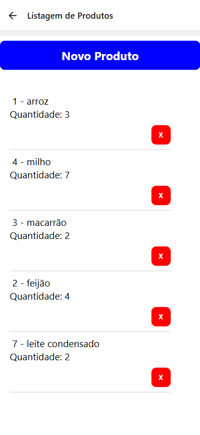
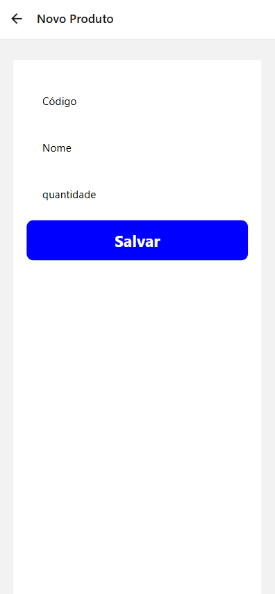
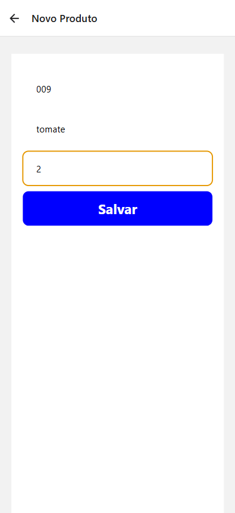

# 🛍️ Sistema de Gestão de Produtos (React Native / Expo)

Este é um projeto de exemplo desenvolvido em React Native usando o framework Expo. Ele demonstra a criação de um aplicativo de listagem e cadastro de produtos, utilizando o AsyncStorage para persistência de dados e o React Navigation para gerenciamento de telas.

## ✨ Funcionalidades

* **Cadastro de Produtos:** Adição de novos itens com Código, Nome e Quantidade.
* **Listagem Dinâmica:** Exibição de todos os produtos cadastrados em uma lista (FlatList).
* **Exclusão de Produtos:** Remoção de itens da lista e do armazenamento.
* **Persistência de Dados:** Uso do `AsyncStorage` para manter os dados salvos entre as sessões do aplicativo.
* **Navegação:** Uso do `React Navigation` (Stack Navigator) para transição entre a lista e o formulário de cadastro.

## 🛠️ Tecnologias Utilizadas

* **React Native**
* **Expo**
* **React Navigation:** (`@react-navigation/native`, `@react-navigation/stack`)
* **AsyncStorage:** (`@react-native-async-storage/async-storage`)


## 🚀 Como Configurar e Executar

Siga os passos abaixo para clonar e rodar o projeto localmente.

### Pré-requisitos

Você precisa ter o Node.js e o Expo CLI instalados:

```bash
# Instale o Expo CLI globalmente (se ainda não o fez)
npm install -g expo-cli 
````

Ou, se preferir usar `npx`:

```bash
npx expo install
```

### Instalação

1.  **Clone o repositório** (se estiver em um Git, caso contrário, navegue até a pasta do projeto):

    ```bash
    git clone [LINK-DO-SEU-REPOSITORIO]
    cd nome-do-projeto
    ```

2.  **Instale as dependências:**

    ```bash
    npm install
    ```

3.  **Inicie o Servidor de Desenvolvimento:**

    ```bash
    npx expo start
    ```

### Executando no seu Dispositivo

Após executar `npx expo start`, um QR code aparecerá no seu terminal.

1.  **Instale o Expo Go:** Baixe o aplicativo **Expo Go** na Google Play Store (Android) ou Apple App Store (iOS).
2.  **Escaneie o QR Code:**
      * **Android:** Abra o aplicativo Expo Go e use a opção "Scan QR code" (Escanear QR code).
      * **iOS:** Use o aplicativo de Câmera padrão do celular para escanear o código.

> **⚠️ Solução de problemas de QR Code (Network Timed Out):**
> Se você tiver problemas de conexão, pare o servidor (`Ctrl + C`) e inicie no modo túnel:
>
> ```bash
> npx expo start --tunnel
> ```


## 📂 Estrutura de Arquivos Principal

O projeto utiliza a seguinte estrutura, focada na pasta src/ para separar a lógica de apresentação (screens), dados (components/dados) e estilos (styles):

```
.
.
├── assets/
│   └── images/
│       └── (ícones e imagens do Expo)
├── src/
│   ├── components/
│   │   └── dados/
│   │       ├── GestorDados.js    # Lógica de persistência (AsyncStorage CRUD)
│   │       └── Produto.js        # Classe/Modelo do Produto
│   ├── screens/
│   │   └── forms/
│   │       ├── ProdutoForm.js    # Tela de cadastro/edição (usa inputs)
│   │       ├── ProdutoItem.js    # Componente de item individual na lista
│   │       └── ProdutoLista.js   # Tela principal (usa FlatList e exibe ProdutoItem)
│   └── styles/
│       └── CommonStyles.js       # Objeto de estilos centralizado
├── .gitignore
├── App.js                      # Ponto de entrada (Configuração do React Navigation Stack)
```

## Amostras do Aplicativo


| Tela Inicial | Tela de Novo Produto | Cadastrando um Produto |
| :---: | :---: | :---: |
|  |  |  |


## 🧩 Detalhes dos Componentes

### GestorDados.js (src/components/dados/)

Centraliza toda a lógica assíncrona de armazenamento, garantindo que as chaves dos produtos sejam prefixadas (`produto_`) para evitar conflitos com outros dados salvos no dispositivo.

### ProdutoLista.js (src/screens/forms/)

* Utiliza o hook `useState` para armazenar o array de produtos.
* Utiliza os hooks `useEffect` e `useIsFocused` para recarregar a lista sempre que o usuário retornar à tela (garantindo que produtos recém-salvos ou excluídos sejam exibidos).

### ProdutoForm.js (src/screens/forms/)

* Utiliza `useState` para gerenciar os valores dos inputs (Código, Nome, Quantidade).
* A função `salvar` cria um objeto `Produto`, chama o método `gestor.adicionar()` e, após o sucesso, navega de volta para a tela de lista (`ListaProd`).